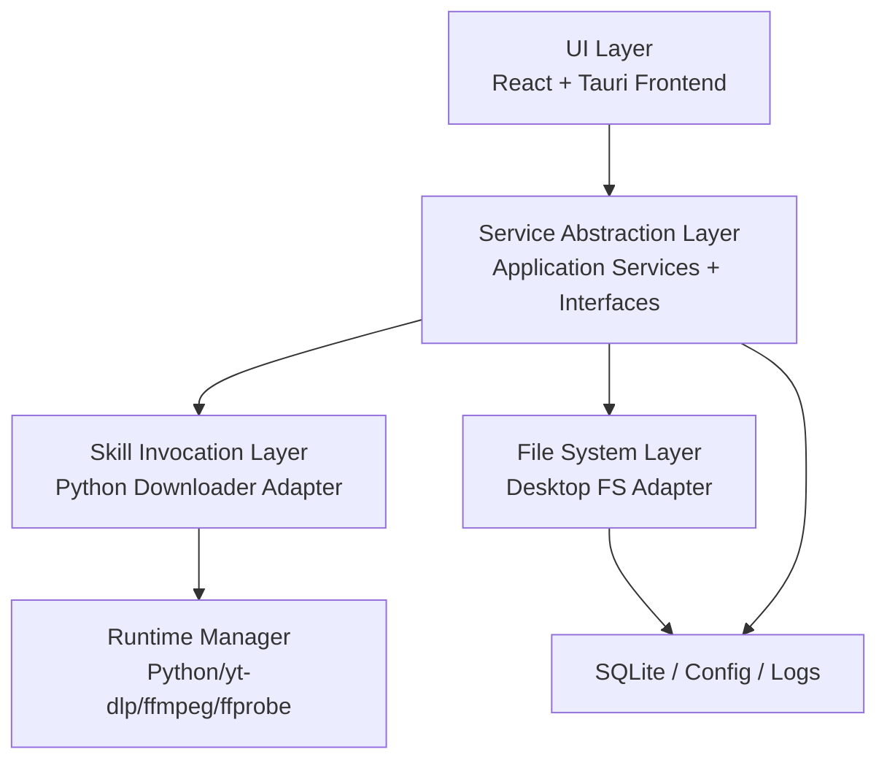
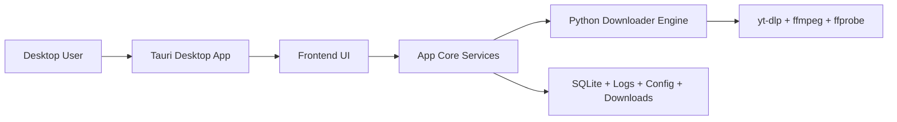
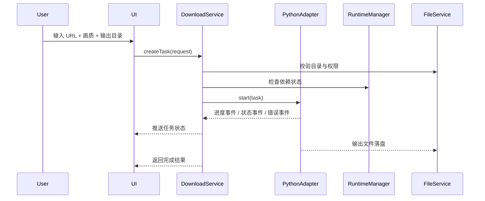

# PC 视频下载工具架构设计文档

## 1. 文档目标

本文档面向当前项目的产品化落地，目标是基于现有仓库中已经验证可行的下载能力，设计一套支持公开发布、可维护、低耦合、可持续演进的 PC 端视频下载工具架构。

本文档覆盖以下内容：

- 跨平台方案选型与决策结论
- 面向 PC 端优先的分层架构设计
- 统一接口规范和通信协议
- 架构决策记录（ADR）
- 工程组织方式、发布策略与实施路线
- 风险清单、规避方案与技术债管理

本文档当前聚焦 PC 平台，Android 只保留架构扩展点，不作为当前一期交付目标。

---

## 2. 背景与现状

### 2.1 当前项目可复用资产

当前仓库已经具备一个可用的下载能力原型：

- 下载脚本：`skills/video-downloader-skill/scripts/video_downloader.py`
- 本地 `yt-dlp` 包装：`.skillhub-home/bin/yt-dlp`
- 已验证依赖链路：`yt-dlp`、`ffmpeg`
- 已完成公开站点实测：YouTube、B 站

结合现有分析报告 [analysis_report.md](file:///Users/wenguanggu/MyProjects/Python/WebVideoDownloader/analysis_report.md)，可以确认：

- 当前能力更像“下载引擎原型”，不是终端产品
- 核心价值在下载内核，而不在 Skill 交互方式
- 现有实现适合抽象成桌面下载服务，不适合直接作为最终软件结构

### 2.2 当前产品化缺口

当前项目尚不具备以下产品能力：

- 图形界面
- 下载任务队列
- 失败重试与任务恢复
- 配置管理
- 下载历史与状态持久化
- 统一错误码
- 日志采集与导出
- 文件目录管理
- 安装包构建
- 自动更新
- 合规提示与使用限制说明

因此本次架构设计的核心任务是：

把“脚本 + 命令依赖”的原型，升级为“桌面可发布软件”。

---

## 3. 需求分析

### 3.1 业务目标

构建一款可供他人使用的 PC 视频下载工具，具备以下特征：

- 面向普通用户，提供 GUI 而非命令行
- 支持输入视频 URL 并下载到本地
- 支持常见站点与 `yt-dlp` 兼容站点
- 支持基础清晰度选择
- 支持下载进度展示
- 支持历史任务查看
- 支持失败提示与日志导出

### 3.2 当前阶段范围

一期目标：

- 仅做 PC 桌面版
- 先支持 macOS 与 Windows
- 支持单任务和有限并发任务
- 支持基础配置、日志和升级机制
- 支持打包发布

暂不纳入一期：

- Android 本地下载
- 云端任务调度
- 账号体系
- 多端同步
- 插件市场
- 浏览器扩展

### 3.3 非功能性要求

- 可落地：团队可以基于现有 Python 能力快速开发
- 可维护：平台差异与业务逻辑分离
- 低耦合：UI 不依赖具体下载实现
- 可扩展：未来可切换下载引擎或增加新平台
- 可测试：核心业务逻辑可独立测试
- 可观测：任务状态、错误、日志可追踪

---

## 4. 方案选型报告

### 4.1 候选方案

本次评估以下三类方案：

- `Electron + Capacitor`
- `Flutter`
- `Tauri`

### 4.2 评估维度

- PC 发布效率
- 现有项目复用度
- Android 未来扩展性
- 打包体积
- 性能与资源占用
- 学习成本
- 维护复杂度
- 社区成熟度
- 与现有 Python 下载内核的整合成本

### 4.3 对比分析

| 方案 | PC 落地效率 | Android 未来扩展 | 现有资源复用 | 包体积 | 性能 | 学习成本 | 维护成本 | 结论 |
| --- | --- | --- | --- | --- | --- | --- | --- | --- |
| `Electron + Capacitor` | 高 | 高 | 中 | 大 | 中 | 低到中 | 中 | 适合 Web/多端统一，但当前 PC-only 阶段偏重 |
| `Flutter` | 中 | 高 | 低 | 中 | 高 | 中到高 | 中 | UI 强，但几乎不能复用现有下载资产 |
| `Tauri` | 高 | 中 | 高 | 小 | 高 | 中 | 中 | 最适合当前 PC 优先阶段 |

### 4.4 最终选择

当前阶段选择：`Tauri`

### 4.5 选择理由

#### 选择 `Tauri` 的原因

- 当前目标已经收敛为 PC 端优先，不需要为了 Android 提前接受更大的桌面包体和更高内存开销
- 当前下载引擎本质是本地命令与脚本调用，`Tauri` 非常适合作为轻量桌面壳
- 相比 `Electron`，`Tauri` 更适合做一个“工具型软件”
- 现有 Python 下载能力可以通过 sidecar 或受控子进程方式接入
- 包体更小，启动更快，桌面端分发体验更好

#### 不选择 `Electron + Capacitor` 的原因

- 它更适合“Web/桌面/移动共用前端代码”的中长期策略
- 但当前用户已明确聚焦 PC，优先级从“多端兼容”切换为“桌面快速落地”
- 在当前阶段引入 Electron，会多承担包体、内存和桌面壳维护成本

#### 不选择 `Flutter` 的原因

- 现有仓库资产几乎无法直接复用
- 下载引擎与前端都要重新组织
- 当前没有 Dart/Flutter 现成工程积累，不利于快速落地

### 4.6 选型结论

当前阶段采用：

- 前端壳：`Tauri`
- UI：`React + TypeScript`
- 下载引擎：`Python Downloader Engine`
- 媒体工具：`yt-dlp`、`ffmpeg`、`ffprobe`
- 配置与本地数据：`SQLite + JSON 配置`

### 4.7 选型风险与规避

| 风险 | 描述 | 规避策略 |
| --- | --- | --- |
| Rust/Tauri 学习成本 | 团队可能不熟悉 Rust | Rust 层只负责宿主能力和 IPC，业务逻辑主要留在 TypeScript 和 Python |
| Python 运行时打包复杂 | 用户环境不能依赖系统 Python | 采用内置 Python 运行时或将引擎打包为独立 sidecar |
| 命令行依赖跨平台差异 | `ffmpeg/ffprobe` 路径和权限问题 | 使用统一 Runtime 管理器安装、检测和调用依赖 |
| 后续 Android 迁移成本 | Tauri 的移动端路线不是当前主目标 | 通过接口隔离下载服务，为未来 Android 独立实现保留扩展点 |

---

## 5. 总体架构

### 5.1 架构原则

- 分层明确，依赖单向流动
- 接口优先，隔离实现细节
- 平台差异集中收口
- 下载引擎与 UI 解耦
- 日志、错误、状态统一建模
- 先满足 PC 落地，再为未来保留扩展点

### 5.2 四层架构

系统采用以下四层：

1. UI 层
2. 服务抽象层
3. 技能调用层
4. 文件系统层

### 5.3 架构组件图



### 5.4 运行时部署图



### 5.5 核心数据流



---

## 6. 分层架构设计

## 6.1 UI 层

职责：

- 界面渲染
- 用户交互
- 表单校验
- 状态展示
- 错误提示
- 历史任务浏览

典型页面：

- 首页下载面板
- 任务列表页
- 下载详情页
- 设置页
- 日志与诊断页
- 关于与合规说明页

约束：

- 不直接调用 Python、命令行和文件路径
- 不直接依赖 `yt-dlp` 参数格式
- 只通过服务接口与系统交互

建议技术：

- `React`
- `TypeScript`
- `Zustand` 或 `Redux Toolkit`
- `TanStack Query` 处理异步状态
- `Tauri event` 或自定义事件总线接收进度

## 6.2 服务抽象层

职责：

- 定义应用服务接口
- 编排任务生命周期
- 转换领域模型
- 统一错误处理
- 提供可观测性与日志入口

核心服务：

- `IDownloadService`
- `ITaskService`
- `IRuntimeService`
- `ISettingsService`
- `IFileService`
- `ILogService`

约束：

- 只依赖接口，不依赖具体平台实现
- 所有状态流转必须经过服务层

## 6.3 技能调用层

职责：

- 封装现有下载能力
- 调用 Python 下载引擎
- 解析标准输出和错误输出
- 将命令行语义转换为结构化事件

核心组件：

- `DownloaderProcessAdapter`
- `PythonDownloaderBridge`
- `RuntimeManager`
- `CapabilityInspector`

说明：

- 这一层是对当前 `video_downloader.py` 能力的产品化封装
- 它不暴露命令行细节给 UI
- 它是未来更换下载引擎时的隔离层

## 6.4 文件系统层

职责：

- 管理下载目录
- 管理日志目录
- 管理配置目录
- 管理任务数据库路径
- 统一文件命名与安全策略

核心组件：

- `DesktopFileSystemAdapter`
- `PathResolver`
- `DownloadArtifactRepository`
- `LogRepository`

约束：

- 文件系统差异必须集中在这一层
- 上层只依赖抽象接口，不拼接原始路径

---

## 7. 代码组织结构

建议目录结构如下：

```text
WebVideoDownloader/
├── apps/
│   └── desktop/
│       ├── src/
│       │   ├── app/
│       │   ├── pages/
│       │   ├── components/
│       │   ├── stores/
│       │   ├── services/
│       │   └── ipc/
│       └── src-tauri/
│           ├── src/
│           ├── capabilities/
│           └── tauri.conf.json
├── packages/
│   ├── core/
│   │   ├── domain/
│   │   ├── interfaces/
│   │   ├── errors/
│   │   └── events/
│   ├── adapters-desktop/
│   │   ├── runtime/
│   │   ├── downloader/
│   │   └── filesystem/
│   └── shared/
│       ├── types/
│       ├── constants/
│       └── utils/
├── engine/
│   └── python-downloader/
│       ├── src/
│       │   ├── main.py
│       │   ├── formatter.py
│       │   ├── runtime_check.py
│       │   ├── event_protocol.py
│       │   └── adapters/
│       ├── requirements.txt
│       └── pyproject.toml
├── docs/
│   ├── adr/
│   ├── diagrams/
│   └── operations/
├── build/
│   ├── runtime/
│   └── installers/
└── tests/
    ├── unit/
    ├── integration/
    └── e2e/
```

---

## 8. 接口规范定义

### 8.1 领域模型

```ts
export type DownloadStatus =
  | "queued"
  | "running"
  | "completed"
  | "failed"
  | "cancelled";

export interface DownloadRequest {
  url: string;
  preferredQuality?: "best" | "1080p" | "720p" | "480p";
  outputDir?: string;
  filenameTemplate?: string;
  overwritePolicy?: "rename" | "overwrite" | "skip";
}

export interface DownloadTask {
  id: string;
  url: string;
  status: DownloadStatus;
  progress: number;
  downloadedBytes: number;
  totalBytes?: number;
  speedText?: string;
  etaSeconds?: number;
  outputFile?: string;
  createdAt: string;
  updatedAt: string;
  errorCode?: string;
  errorMessage?: string;
}
```

### 8.2 服务接口

```ts
export interface IDownloadService {
  createTask(input: DownloadRequest): Promise<DownloadTask>;
  startTask(taskId: string): Promise<void>;
  cancelTask(taskId: string): Promise<void>;
  retryTask(taskId: string): Promise<void>;
  getTask(taskId: string): Promise<DownloadTask | null>;
  listTasks(): Promise<DownloadTask[]>;
}

export interface IRuntimeService {
  inspect(): Promise<RuntimeHealth>;
  ensureReady(): Promise<void>;
  getVersions(): Promise<RuntimeVersions>;
}

export interface IFileService {
  ensureOutputDir(path?: string): Promise<string>;
  revealInFinder(path: string): Promise<void>;
  exists(path: string): Promise<boolean>;
}

export interface ILogService {
  info(message: string, context?: Record<string, unknown>): Promise<void>;
  warn(message: string, context?: Record<string, unknown>): Promise<void>;
  error(message: string, context?: Record<string, unknown>): Promise<void>;
}
```

### 8.3 运行时健康检查模型

```ts
export interface RuntimeHealth {
  ready: boolean;
  python: BinaryStatus;
  ytDlp: BinaryStatus;
  ffmpeg: BinaryStatus;
  ffprobe: BinaryStatus;
  issues: RuntimeIssue[];
}

export interface BinaryStatus {
  exists: boolean;
  version?: string;
  path?: string;
}

export interface RuntimeIssue {
  code: string;
  level: "error" | "warn";
  message: string;
  actionHint?: string;
}
```

### 8.4 事件总线规范

使用统一事件模型，避免 UI 直接依赖命令输出格式。

```ts
export type AppEvent =
  | DownloadProgressEvent
  | DownloadStateChangedEvent
  | RuntimeIssueDetectedEvent;

export interface DownloadProgressEvent {
  type: "download.progress";
  taskId: string;
  progress: number;
  downloadedBytes: number;
  totalBytes?: number;
  speedText?: string;
  etaSeconds?: number;
  timestamp: string;
}

export interface DownloadStateChangedEvent {
  type: "download.state_changed";
  taskId: string;
  status: "queued" | "running" | "completed" | "failed" | "cancelled";
  outputFile?: string;
  errorCode?: string;
  errorMessage?: string;
  timestamp: string;
}
```

### 8.5 异步调用规范

- 所有服务接口统一返回 `Promise`
- 所有失败都返回结构化异常，而不是原始 stderr 文本
- 所有长耗时调用必须发出中间事件
- 取消操作必须可幂等，多次取消结果一致

### 8.6 错误码规范

建议统一错误码前缀：

- `DL-` 下载错误
- `RT-` 运行时错误
- `FS-` 文件系统错误
- `CFG-` 配置错误

示例：

| 错误码 | 含义 |
| --- | --- |
| `DL-001` | URL 非法 |
| `DL-002` | 不支持的视频站点或解析失败 |
| `DL-003` | 下载中断 |
| `RT-001` | Python 不可用 |
| `RT-002` | `yt-dlp` 不可用 |
| `RT-003` | `ffmpeg` 不可用 |
| `RT-004` | `ffprobe` 不可用 |
| `FS-001` | 输出目录无权限 |
| `FS-002` | 文件写入失败 |

---

## 9. Python 下载引擎设计

### 9.1 目标

将当前 `video_downloader.py` 从 Skill 脚本升级为稳定的产品级引擎。

### 9.2 需要重构的内容

当前脚本存在以下问题：

- 命令行参数格式简单，不适合作为产品 API
- 标准输出缺乏结构化事件
- 错误输出未标准化
- 与文件系统、运行时检查耦合较深
- 测试能力弱

### 9.3 重构后建议

将引擎拆成：

- `main.py`：CLI 入口
- `downloader.py`：下载流程编排
- `runtime_check.py`：检查 Python/yt-dlp/ffmpeg/ffprobe
- `event_protocol.py`：统一 JSON 事件输出
- `errors.py`：定义错误码
- `site_capabilities.py`：站点能力信息

### 9.4 引擎标准输出协议

建议 Python 引擎只输出 JSON 行：

```json
{"type":"task.started","taskId":"t_001","timestamp":"2026-05-13T10:00:00Z"}
{"type":"task.progress","taskId":"t_001","progress":42.5,"speedText":"1.2MiB/s","etaSeconds":31}
{"type":"task.completed","taskId":"t_001","outputFile":"/Downloads/demo.mp4"}
```

这样前端和宿主层无需解析人类可读字符串。

---

## 10. 持久化设计

### 10.1 存储方案

- 任务表：`SQLite`
- 设置表：`SQLite` 或 JSON 配置文件
- 日志文件：按日期滚动文本日志
- 下载文件：用户指定目录

### 10.2 任务表建议

| 字段 | 类型 | 说明 |
| --- | --- | --- |
| `id` | TEXT | 任务 ID |
| `url` | TEXT | 原始 URL |
| `status` | TEXT | 当前状态 |
| `progress` | REAL | 百分比 |
| `output_file` | TEXT | 输出文件 |
| `error_code` | TEXT | 错误码 |
| `error_message` | TEXT | 错误信息 |
| `created_at` | TEXT | 创建时间 |
| `updated_at` | TEXT | 更新时间 |

### 10.3 设置项建议

- 默认下载目录
- 默认清晰度
- 最大并发数
- 是否下载完成自动打开目录
- 是否自动检查更新
- 是否启用详细日志

---

## 11. 安全与合规

### 11.1 安全要求

- 不执行用户拼接的任意命令
- 所有命令调用必须走白名单参数构造
- 所有路径必须标准化与权限校验
- 所有配置变更需可审计

### 11.2 合规要求

该产品必须在界面、官网和许可协议中明确说明：

- 用户仅可下载其拥有权利或被授权下载的内容
- 不保证任何第三方平台长期可用
- 某些平台内容下载可能受服务条款限制
- 软件不对用户的使用行为承担内容授权责任

### 11.3 风险点

- YouTube 等平台的服务条款限制
- 版权内容下载与传播风险
- 应用分发平台审查风险

### 11.4 规避策略

- 首发采用官网分发与 GitHub Releases
- 不以“突破限制”为宣传卖点
- 不内置违规站点绕过逻辑
- 使用通用“媒体下载工具”定位

---

## 12. 测试策略

### 12.1 单元测试

覆盖：

- 参数校验
- 任务状态机
- 错误码映射
- 路径解析
- 配置读取与迁移

### 12.2 集成测试

覆盖：

- Python 引擎启动
- 依赖检测
- 下载任务创建
- 日志写入
- 文件生成

### 12.3 E2E 测试

覆盖：

- GUI 创建任务
- 展示进度
- 完成后打开目录
- 失败时提示日志路径

### 12.4 回归测试重点

- 运行时依赖缺失
- 下载格式选择错误
- 文件名冲突
- 同目录重复下载
- 任务取消和重试

---

## 13. 架构决策记录（ADR）

## ADR-001：当前阶段以 PC 为唯一交付目标

### 背景

Android 本地下载涉及运行时、权限、后台任务、上架审核等复杂问题。

### 决策

当前阶段只交付 PC 版，Android 仅保留架构扩展点。

### 影响

- 降低一期复杂度
- 加快桌面版落地
- 减少无效预设计

## ADR-002：桌面壳选择 Tauri

### 背景

当前目标从多端统一调整为桌面工具发布。

### 决策

采用 `Tauri + React + TypeScript`。

### 影响

- 包体更小
- 启动更快
- 需要少量 Rust 宿主代码

## ADR-003：下载核心保留 Python 实现

### 背景

仓库已有可用 Python 下载原型，且与 `yt-dlp` 协同良好。

### 决策

保留 Python 作为下载引擎，不在一期重写为 Rust 或 Node。

### 影响

- 降低重写成本
- 提高一期落地速度
- 需要解决 Python 运行时打包问题

## ADR-004：采用四层架构隔离 UI 与下载实现

### 背景

当前 Skill 原型耦合较高，不适合直接扩展。

### 决策

引入 UI 层、服务抽象层、技能调用层、文件系统层。

### 影响

- 降低耦合
- 增强可测试性
- 为未来更换引擎保留空间

## ADR-005：下载状态采用事件驱动

### 背景

下载任务是长时间运行任务，不适合仅依赖同步返回值。

### 决策

使用统一事件模型驱动进度展示与状态同步。

### 影响

- 便于 UI 响应式更新
- 便于日志与任务历史记录

---

## 14. 扩展点设计

### 14.1 新平台扩展

未来如果重新进入 Android：

- 保留 `IDownloadService` 接口不变
- 替换技能调用层实现
- 增加 `AndroidFileSystemAdapter`

### 14.2 新下载引擎扩展

如果未来不再使用 Python：

- 保留服务接口不变
- 替换 `PythonDownloaderBridge`
- 增加 `RustDownloaderAdapter` 或 `NodeDownloaderAdapter`

### 14.3 新功能扩展

预留以下能力：

- 浏览器 Cookie 导入
- 仅音频下载
- 批量任务导入
- 剪贴板自动识别
- 代理设置
- 自动命名模板

---

## 15. 实施建议

### 15.1 第一阶段：下载引擎产品化

目标：

- 抽离当前 Python 脚本为独立引擎模块
- 增加结构化事件输出
- 增加错误码与运行时检查

产出：

- `engine/python-downloader`
- 基础单元测试

### 15.2 第二阶段：桌面宿主与 UI MVP

目标：

- 建立 Tauri 桌面工程
- 实现下载输入、任务列表、设置页
- 接通本地依赖检测与下载流程

产出：

- 可运行的桌面 MVP 安装包

### 15.3 第三阶段：可靠性增强

目标：

- 加入失败重试
- 加入下载历史
- 加入日志导出
- 加入自动更新

产出：

- 面向外部用户的小规模测试版本

### 15.4 第四阶段：公开发布

目标：

- 完成官网页面
- 完成安装包签名与发布
- 完成隐私说明与许可文档

产出：

- `v1.0.0` 公测版

---

## 16. 技术债管理

### 当前已知技术债

- 现有 Python 脚本仍然保留原型痕迹
- `ffprobe` 依赖未完整纳入运行时管理
- 当前工作区内 `yt-dlp` 包装方式不适合作为正式发布方案
- 任务状态持久化尚不存在

### 管理原则

- 技术债必须登记到 `docs/adr` 或 `docs/operations/debt.md`
- 每个版本至少偿还一项高优先级技术债
- 与下载稳定性、日志可观测性相关的债务优先处理

---

## 17. Roadmap

### 里程碑 M1：内核稳定化

- Python 引擎模块化
- 事件协议标准化
- 错误码标准化

### 里程碑 M2：桌面 MVP

- Tauri 工程初始化
- GUI 下载入口
- 任务列表
- 基础设置

### 里程碑 M3：Beta 可测试版

- SQLite 持久化
- 日志中心
- 自动更新
- 安装包构建

### 里程碑 M4：公开版

- 签名发布
- 官网文档
- 合规提示
- 问题反馈链路

---

## 18. 最终结论

基于当前项目资源，最合理、最可落地的方案不是继续扩展 Skill，而是：

- 以现有 Python 下载能力为核心
- 使用 `Tauri + React + TypeScript` 构建桌面产品壳
- 通过四层架构将 UI、服务编排、下载引擎和文件系统彻底解耦
- 在一期聚焦 PC 端完成产品化，避免 Android 提前侵入架构复杂度

该方案具备以下优势：

- 对现有资产复用最大
- 对产品落地最友好
- 对后续维护成本可控
- 对未来平台扩展保留接口空间

如果按本文档实施，当前项目可以从“可运行的下载脚本”演进为“可发布的桌面下载工具软件”。

